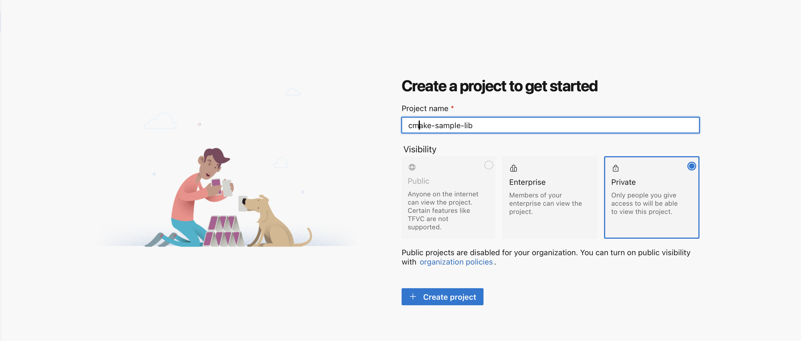
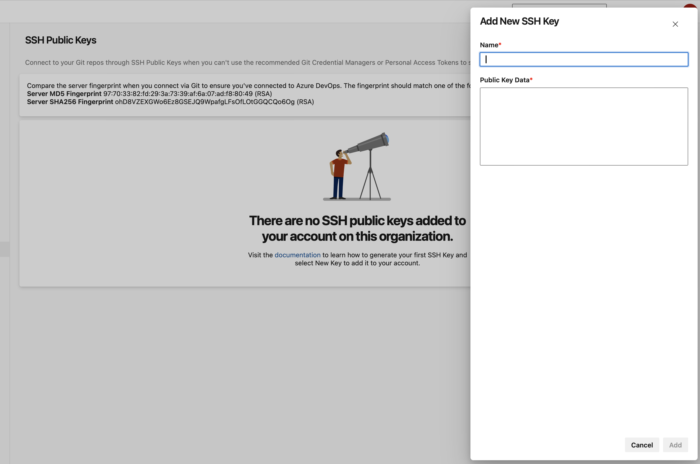

# Tutorial: Package a private ADO dependency


## Prerequisites:

- Basic understanding of Git and vcpkg.
- Access to Azure DevOps with permissions to create projects and manage SSH keys.
- `vcpkg` installed on your system. Installation Guide.
- Git installed on your system.

## 1 - Create a private project

1. Log into your Azure DevOps account
2. Create a new private project. If you don't have an organization, you'll be prompted to create one during the project creation process.
    - Name your project: Choose a meaningful name that reflects your library or its purpose.
    - Visibility: Ensure the project is set to "Private" to control access.
        


## 2 - Set Up Authentication in Azure DevOps

Secure access to your repository with SSH keys.

1. Generate an SSH Key Pair

- Open a terminal or command prompt.
- Run the following command:

    ```bash
    ssh-keygen -t rsa -b 4096 -C "ADO-RSA" -f ~/.ssh/id_rsa_ado
    ```

    - `-t rsa`: Specifies the type of key to create, in this case, RSA.
    - `-b 4096`: Sets the number of bits in the key, in this case, 4096, which is considered strong and secure.
    - `-C "ADO-RSA"`: Adds a label to the key for identification, which can be particularly useful when you have multiple keys.
    - `-f ~/.ssh/id_rsa_ado`: Specifies the filename for the new key. This command saves the private key to `id_rsa_ado` and the public key to `id_rsa_ado.pub` in your `~/.ssh` directory.

    You'll be prompted to enter a passphrase for additional security. You can either enter a passphrase or press Enter to proceed without one. A passphrase adds an extra layer of security by requiring the passphrase to be entered whenever the key is used.

- After the key generation, confirm the new key is created by listing the contents of your ~/.ssh directory again:
    ```bash
    ls ~/.ssh
    ```

2. Add your SSH key to Azure DevOps
    - Open the `id_rsa_ado.pub` file with a text editor to view the public key.
    - Copy the entire content of the file.
    - Navigate to your **User Settings > SSH Public Keys**.
        
    - Add your new key by pasting the copied content and name your key for future reference.
        

3. Load your SSH key into the SSH agent.

    Ensure your SSH key is available for authentication:

    ```bash
    ssh-add ~/.ssh/id_rsa_ado    
    ```

4. Test SSH connection

    Verify connectivity to Azure DevOps:

    ```bash
    ssh -T git@ssh.dev.azure.com
    ```

    Expect a message indicating successful authentication but noting that shell access is not supported.

    ```
    ssh -T git@ssh.dev.azure.com
    remote: Shell access is not supported.
    shell request failed on channel 0
    ```
    
## 3 - Upload library to ADO repo

1. Initialize a local git repository
    
    Navigate to your library's source code directory and initialize a Git repository:

    ```bash
    git init
    ```

2. Commit your library
    Add and commit your library's source code:

    ```bash
    git add .
    git commit -m "Initial commit of the sample library"
    ```

3. Link to Your Azure DevOps Repository

    Retrieve your repository's SSH URL from Azure DevOps and add it as a remote:

    

    ```bash
    git remote add origin <Your-Repo-SSH-URL>
    ```

4. Push Your Library

    Upload your library to the Azure DevOps repository:

    ```bash
    git push -u origin master:main
    ```

## 4 - Package your library into an overlay port

Overlay ports allow you to use local ports with vcpkg.

1. Create an overlay ports directory

    ```bash
    mkdir vcpkg-overlay-ports
    cd vcpkg-overlay-ports
    ```

2. Set up the port files

- `vcpkg.json`: This manifest file defines your library's metadata and dependencies.
    ```json
    {
        "name": "vcpkg-sample-library",
        "version": "1.0.0",
        "homepage": "",
        "description": "A sample C++ library designed to serve as a foundational example for a tutorial on packaging libraries with vcpkg.",
        "license": "MIT",
        "dependencies": [
        {
            "name" : "vcpkg-cmake",
            "host" : true
        },
        {
            "name" : "vcpkg-cmake-config",
            "host" : true
        },
        "fmt"
        ]
    }
    ```

    The `vcpkg.json` file serves as a manifest that defines metadata and dependencies for a C++ library, providing vcpkg with the necessary information to build, install, and manage the package.

    - `name`: Specifies the name of the library. This is used as the package identifier.
    - `version`: Indicates the version number of the library.
    - `homepage`: URL to the project's homepage, often its repository. Useful for those who want to know more or contribute.
    - `description`: Brief text describing what the library does. This is for documentation and users.
    - `license`: Specifies the license under which the library is distributed.
    - `dependencies`: An array containing the list of dependencies that the library needs.
    - `name`: vcpkg-cmake: Specifies a dependency on vcpkg-cmake, which provides CMake functions and macros commonly used in vcpkg ports.
    - `host`: true: Specifies that vcpkg-cmake is a host dependency, meaning it's required for building the package but not for using it.
    - `name`: vcpkg-cmake-config: Specifies a dependency on vcpkg-cmake-config, which assists in using CMake config scripts.
    - `fmt`: Specifies a run-time dependency on the fmt library. This means fmt is required for both building and using the package.

    For more information on `vcpkg.json`, see the following documentation on manifests.

- `portfile.cmake` : This script tells vcpkg how to build your library.
    ```cmake
    vcpkg_check_linkage(ONLY_STATIC_LIBRARY)

    vcpkg_from_git(
        OUT_SOURCE_PATH SOURCE_PATH
        URL git@ssh.dev.azure.com:v3/javiermat/cmake-sample-lib/cmake-sample-lib
        REF d8a36764e26379277a9765827aaefc6cebd8b7d3
    )

    vcpkg_cmake_configure(
        SOURCE_PATH "${SOURCE_PATH}"
    )

    vcpkg_cmake_install()

    vcpkg_cmake_config_fixup(PACKAGE_NAME "my_sample_lib")

    file(REMOVE_RECURSE "${CURRENT_PACKAGES_DIR}/debug/include")

    file(INSTALL "${SOURCE_PATH}/LICENSE" DESTINATION "${CURRENT_PACKAGES_DIR}/share/${PORT}" RENAME copyright)
    ```

    This portfile defines how to download, build, install, and package a specific C++ library from GitHub using vcpkg.

    - `vcpkg_check_linkage(ONLY_STATIC_LIBRARY)`: Specifies that only static linking is supported for this package.
    - `vcpkg_from_github`: Starts the function to download the source code from a GitHub repository.
    - `OUT_SOURCE_PATH SOURCE_PATH`: Sets the directory where the source code will be extracted.
    - `URL git@ssh.dev.azure.com:v3/javiermat/cmake-sample-lib/cmake-sample-lib`: The SSH URL for the repository containing the source code.
    - `REF d8a36764e26379277a9765827aaefc6cebd8b7d3`: The commit sha.
    - `vcpkg_cmake_configure`: Configures the project using CMake, setting up the build.
    - `SOURCE_PATH "${SOURCE_PATH}"`: The path to the source code downloaded earlier.
    - `vcpkg_cmake_install()`: Builds and installs the package using CMake.
    - `vcpkg_cmake_config_fixup(PACKAGE_NAME "my_sample_lib")`: Fixes the CMake package configuration files to be compatible with Vcpkg.
    - `file(REMOVE_RECURSE "${CURRENT_PACKAGES_DIR}/debug/include")`: Deletes the include directory from the debug installation to prevent overlap.
    - `file(INSTALL "${SOURCE_PATH}/LICENSE" DESTINATION ...)`: Installs the LICENSE file to the package's share directory and renames it to copyright.

    For more information on `portfile.cmake`, refer to the maintainer guide.

To get REF
mkdir temp
git init
git fetch git@ssh.dev.azure.com:v3/javiermat/cmake-sample-lib/cmake-sample-lib main --depth 1 -n
git rev-parse FETCH_HEAD
`d8a36764e26379277a9765827aaefc6cebd8b7d3`

3. Install your port

    Back in your main vcpkg directory, install your library specifying the overlay ports directory:

    ```bash
    vcpkg install vcpkg-sample-library --overlay-ports=vcpkg-overlay-ports
    ```


## Next Steps

And that's it! You have packaged your private ADO dependency.
